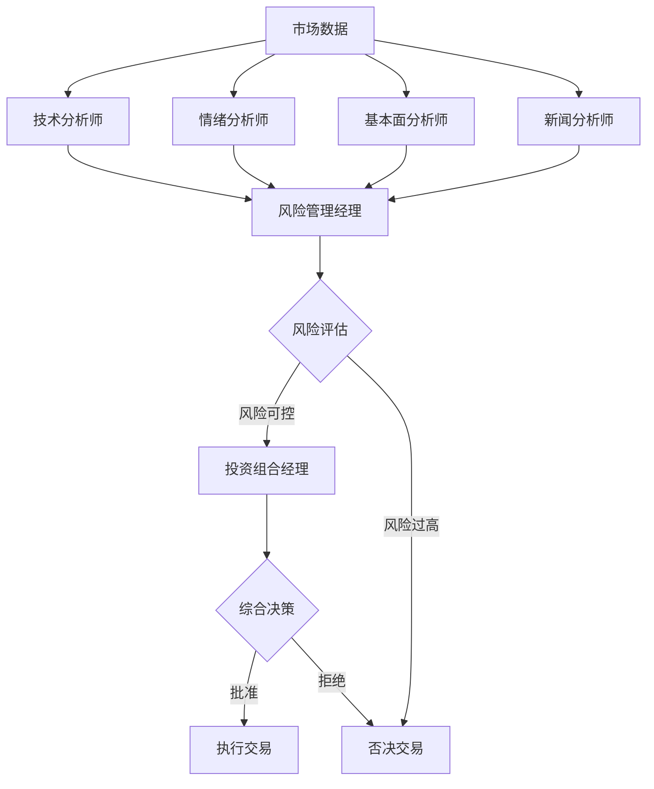

# 多智能体协同决策系统

## 🤖 系统架构

我们的AI交易平台采用多智能体协同架构，模拟专业投资团队的工作方式，每个智能体专注于特定领域，协同完成交易决策。

## 👥 团队成员

### 1. 技术分析师 (Technical Analyst)
**使用模型**: GPT-4  
**优先级**: ⭐⭐⭐⭐⭐ (短期交易最重要)

**职责**:
- 分析技术指标（MACD、RSI、布林带等）
- 识别图表形态和趋势
- 确定支撑位和阻力位
- 提供入场和出场点位

**关注指标**:
- RSI（相对强弱指标）
- MACD（移动平均收敛发散指标）
- 移动平均线（MA5, MA10, MA20, MA50）
- 波动率分析
- 成交量分析

---

### 2. 情绪分析师 (Sentiment Analyst)
**使用模型**: DeepSeek  
**优先级**: ⭐⭐⭐⭐ (短期情绪对交易影响大)

**职责**:
- 分析社交媒体情绪
- 监测市场热度和讨论度
- 识别FOMO（错失恐惧）和FUD（恐惧不确定怀疑）
- 评估散户vs机构情绪

**分析维度**:
- 社交媒体提及量
- 正面/负面情绪比例
- 影响力人物观点
- 社区活跃度
- 情绪变化趋势

---

### 3. 新闻分析师 (News Analyst)
**使用模型**: Grok  
**优先级**: ⭐⭐⭐⭐ (重大新闻可能改变市场)

**职责**:
- 监控加密货币相关新闻
- 分析宏观经济影响
- 追踪监管动态
- 评估项目重大公告

**关注领域**:
- 项目技术升级和合作
- 监管政策变化
- 宏观经济数据
- 地缘政治风险
- 竞争对手动态

---

### 4. 基本面分析师 (Fundamental Analyst)
**使用模型**: GPT-4  
**优先级**: ⭐⭐⭐ (长期价值判断)

**职责**:
- 评估代币内在价值
- 分析项目技术实力
- 评估团队和社区
- 识别长期投资机会

**评估维度**:
- 市值和估值
- 项目技术创新性
- 团队背景和信誉
- 代币经济模型
- 市场竞争地位

---

### 5. 风险管理经理 (Risk Manager)
**使用模型**: GPT-4  
**优先级**: ⭐⭐⭐⭐⭐ (拥有否决权)

**职责**:
- 评估市场波动性
- 监控流动性风险
- 计算风险价值(VaR)
- 设置止损止盈
- **拥有否决权**：当风险过高时可以否决交易

**风险指标**:
- 价格波动率
- 流动性评分
- 仓位集中度
- 最大回撤
- 夏普比率

**风控规则**:
- 风险评分 > 0.7 → 可能否决交易
- 持仓超过50% → 警告
- 波动率 > 10% → 高风险标记

---

### 6. 投资组合经理 (Portfolio Manager)
**使用模型**: GPT-4  
**角色**: 最终决策者

**职责**:
- 综合所有分析师意见
- 平衡短期和长期因素
- 做出最终交易决策
- 批准或拒绝交易

**决策考量**:
1. 风险管理经理意见（最高优先级）
2. 技术+情绪分析（短期）
3. 基本面+新闻分析（长期）
4. 投资组合整体平衡

---

## 🔄 决策流程



## 📊 决策权重

各分析师的权重根据交易类型动态调整：

### 短期交易（1-7天）
1. 技术分析师: 35%
2. 情绪分析师: 30%
3. 风险管理: 20%
4. 新闻分析: 10%
5. 基本面: 5%

### 中期交易（1-4周）
1. 技术分析师: 25%
2. 基本面分析: 25%
3. 风险管理: 20%
4. 新闻分析: 15%
5. 情绪分析: 15%

### 长期投资（1月+）
1. 基本面分析: 40%
2. 风险管理: 25%
3. 新闻分析: 20%
4. 技术分析: 10%
5. 情绪分析: 5%

## 🎯 优势

相比简单的多模型投票：

### 1. 专业化分工
- 每个智能体专注自己的领域
- 更深入、更专业的分析
- 避免泛泛而谈

### 2. 风险控制
- 专门的风险管理经理
- 拥有否决权
- 系统性风险控制

### 3. 层次化决策
- 并行分析提高效率
- 风险评估作为门槛
- 投资组合经理综合决策

### 4. 可解释性
- 每个决策有明确理由
- 可以追溯到具体分析师
- 便于复盘和优化

### 5. 模拟真实团队
- 贴近专业投资机构运作
- 平衡不同时间维度
- 考虑多个角度

## 💻 技术实现

### Agent基类
```python
class BaseAgent(ABC):
    @abstractmethod
    async def analyze(
        self,
        symbol: str,
        market_data: Dict,
        additional_data: Optional[Dict] = None
    ) -> AgentAnalysis
```

### 团队协同
```python
class AgentTeam:
    async def conduct_team_analysis(
        self,
        symbol: str,
        market_data: Dict,
        portfolio: Dict,
        positions: List[Dict]
    ) -> Dict
```

## 📈 扩展性

系统设计具有良好的扩展性：

1. **添加新的分析师角色**
   - 量化分析师
   - 链上数据分析师
   - 期权策略分析师

2. **集成更多AI模型**
   - Claude (Anthropic)
   - Gemini (Google)
   - 其他专业模型

3. **接入实时数据**
   - Twitter API (情绪分析)
   - News API (新闻分析)
   - Glassnode (链上数据)

4. **策略优化**
   - A/B测试不同权重
   - 机器学习优化决策
   - 回测历史表现

## 🚀 使用示例

```python
# 创建团队
agent_team = AgentTeam()

# 团队分析
decision = await agent_team.conduct_team_analysis(
    symbol="BTC/USDT",
    market_data=market_data,
    portfolio=portfolio,
    positions=positions
)

# 决策结果
print(f"最终决策: {decision['final_decision']}")
print(f"行动: {decision['action']}")
print(f"置信度: {decision['confidence']}")
print(f"理由: {decision['reasoning']}")

# 查看各分析师意见
for analysis in decision['team_analyses']:
    print(f"{analysis['role']}: {analysis['recommendation']}")
```

## 📚 相关文档

- [API文档](API_DOCUMENTATION.md)
- [部署指南](DEPLOYMENT.md)
- [贡献指南](CONTRIBUTING.md)

---

**🎉 多智能体系统让AI交易更专业、更可靠、更可控！**

